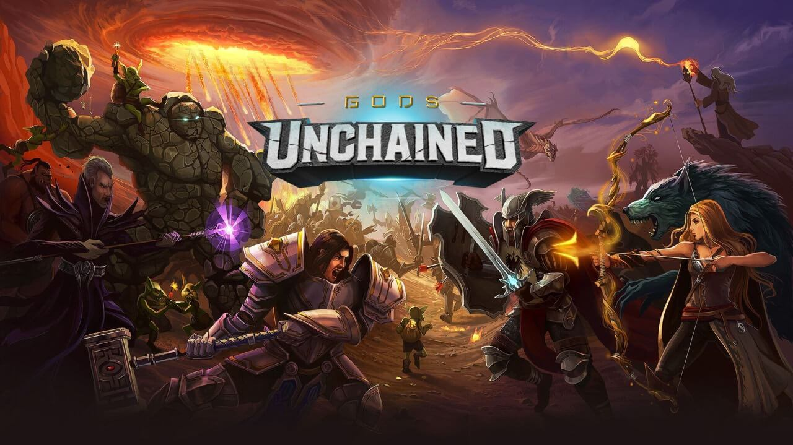
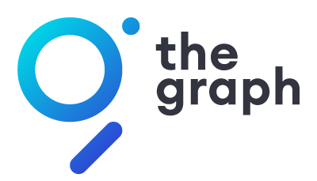

# Gods Unchained Subgraph
TheGraph - Gods Unchained - ETH Waterloo hackathon project

[Try out the Demo](https://djrosenbaum.github.io/godsunchained-subgraph/)

<a href="https://godsunchained.com/"></a>


Some backstory leading up to [ETH Waterloo](https://ethwaterloo.com/). Gods Unchained is in the process of activating [Genesis season ERC-721 tokens](https://etherscan.io/token/0x629cdec6acc980ebeebea9e5003bcd44db9fc5ce). There is no good way at the moment to query for a users's collection of cards including token id, protos, and quality. At the moment immutable's api does allow for querying a given player's cards by 0x address, although unfortunately the token ids are not included. So, I asked in the ETH Waterloo #mentor-help discord channel for some direction here. Which lead me to The Graph. 

For anyone unfamiliar with [The Graph](https://thegraph.com/), this flexible platform enables building a subgraph which then syncs with Ethereum's blockchain enabling simple yet powerful Graph QL queries to fetch exactly the data needed. 

For anyone unfamiliar with Gods Unchained, think Magic the Gathering meets Hearthstone meets Blockchain.

If you still don't know what a subgraph is it's basically something that indexes and structures data for querying.

TLDR; I was struggling with a way to fetch all of an owner's Gods Unchained tokens as well as the token's proto and quality. [The Graph](https://thegraph.com/) was the answer.

Read on to find out how it works...

## Try it Out
Subgraph for querying Gods Unchained Token info

https://thegraph.com/explorer/subgraph/djrosenbaum/godsunchained?version=pending

Example Query
```
{
  tokens(first: 5) {
    id
    owner {
      id
    }
    proto
    quality
  }
}
```

## Pre-Development
<a href="https://thegraph.com/"></a>

Before developing get familiar with The Graph docs.

https://thegraph.com/docs/quick-start

## Development
1. clone the repo
2. nvm use (developed with node v10.16.0)
3. npm install

Once installed there are only 3 files you might want to play around with to extend and or build a new subgraph.

* [subgraph.yaml](./subgraph.yaml)
* [schema.graphql](./schema.graphql)
* [./src/token.ts](./src/token.ts)